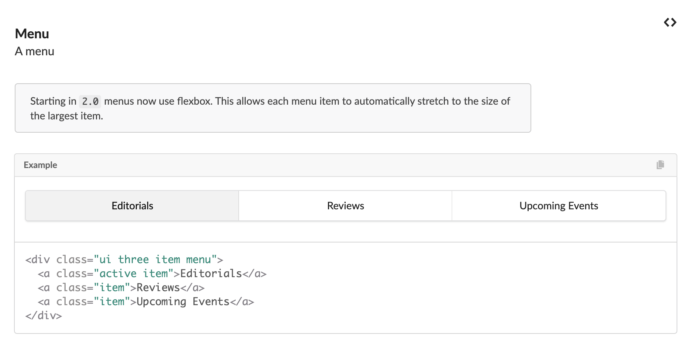

Imagine, you’ve procrastinated on a web project to build an online shop that is due in less than 24 hours. But don’t fret, because Semantic UI is here to help!

## Semantic UI is beginner-friendly

Jokes aside, Semantic UI is user- and beginner-friendly for those who are just getting into web development. I have basic knowledge in HTML because one time in high school I got bored and learned it myself but never got beyond creating sites that look like it came out of the 90s because I never got to learn CSS nor was introduced to UI. I thought that modern-looking websites were for advanced programmers (which can be true). Being introduced to UI Frameworks made me realize that even as a beginner in web design, you can create websites that look presentable in this day and age. Being able to produce quality work with UI Frameworks as a beginner is motivating for those who are interested in getting into web development.

## Semantic UI is well-documented

I was talking to Kat, a peer in my Software Engineering class, this morning about how easy Semantic UI was. We talked about our experiences with social media platforms that allow the user to customize the appearance of one's own profile, such as MySpace and Tumblr, that introduced us to HTML. She brought up that the documentation of Semantic UI was well-written and easy to read. That made me realize that it was the same for me. If it wasn’t for the live demos on the Semantic UI website, I probably would have struggled with this UI Framework.

<figure>
  
  <figcaption>Demo of Semantic UI Menu and its code.</figcaption>
</figure>

## UI Framewoks makes your code tidier

Though UI Frameworks can be complicated, a benefit from using it is that you could reduce the code of your individual web projects to contain the structure, content, and its customization. It makes it easy to read the code because it would look less “cluttered,” making the debugging process easier for the developer. Another benefit to using UI Frameworks would be that you could easily implement your designs into another project without having to rewrite the code from scratch. This means if a UI code is already written, you don’t have to keep writing the code because you can just use a UI Framework that already covers that.
