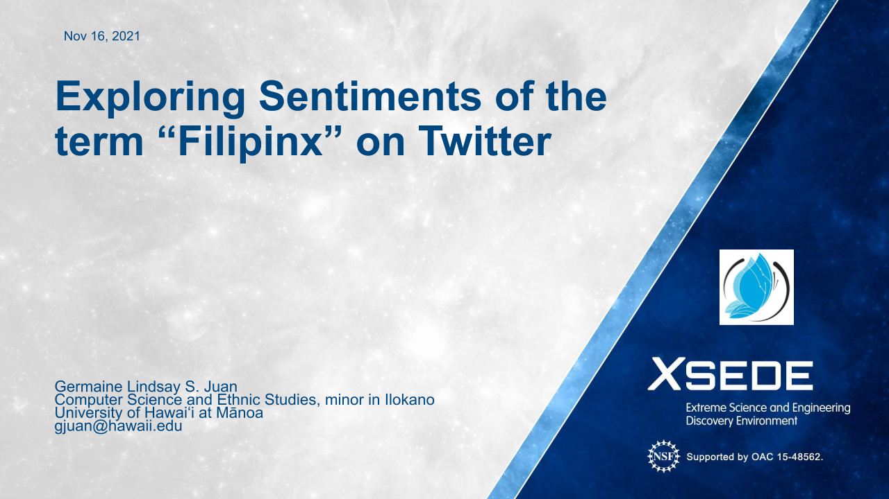
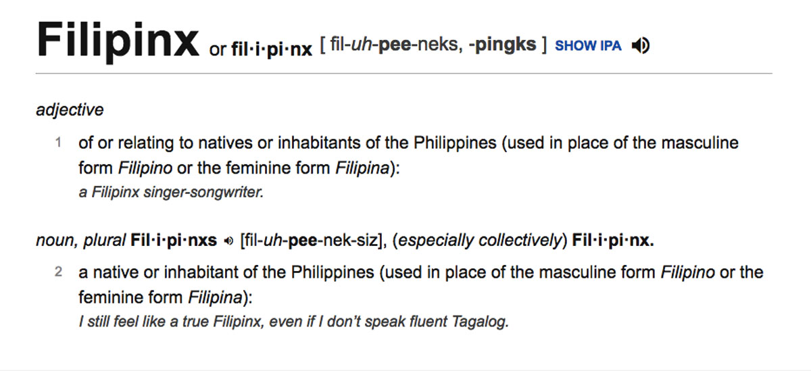
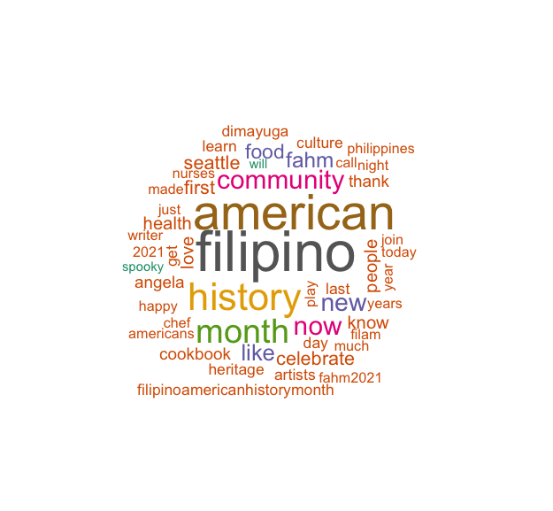
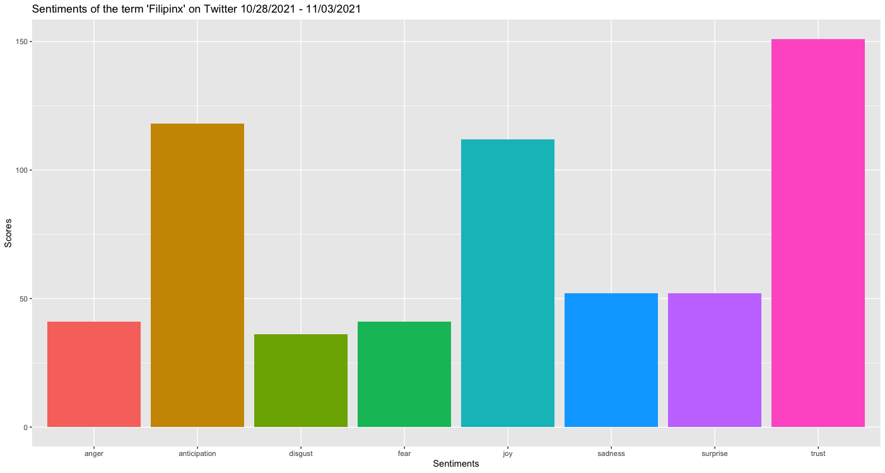
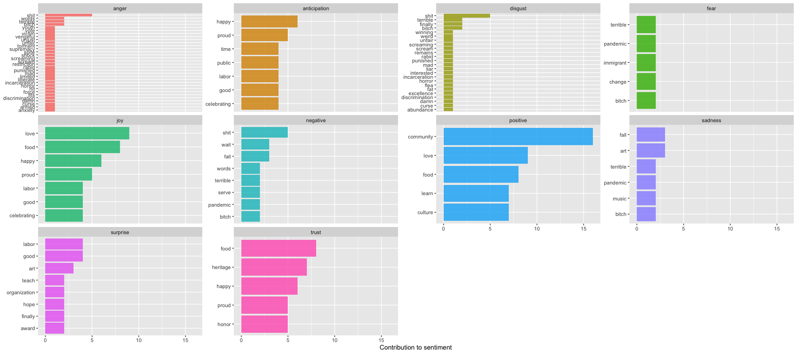

This project was conducted for [Computing4Change](https://www.sighpc.org/for-our-community/computing4change) aka Advanced Computing for Social Change (C4C-ACSC) presented at [SC21](https://sc21.supercomputing.org/). I was mentored by Dr. Rylan Chong from Chaminade University, as well as by previous C4C contestants and Data Science majors at Chaminade University, Dairian Balai and Taylor Ishisaka.

## Background

In September 2020, Dictionary.com added "Filipinx" and defined it as “of or relating to natives or inhabitants of the Philippines (used in place of the masculine form Filipino or the feminine form Filipina).” This caused an intense discourse on social media, especially on Twitter, regarding the semantics of gender and ethnic identity, creating a visible divide between homeland Filipinos and Filipinos in diaspora. People against "Filipinx" claim that "Filipino" is used in a gender-neutral context in the Philippines, while defenders of "Filipinx" say that it is for those who live or grew up outside of the Philippines whose gendered language(s) perform differently.

## Method

I worked with qualitative data to conduct my research. We web scraped through the Twitter API for six days worth of publicly available data. All tweets in the dataset were published between October 28, 2021 to November 3, 2021. There were 198 tweets total. The tools that I used were Excel to clean up my data; and R to conduct my analysis and create visualizations, which were a word cloud and bar graphs for sentiment analysis.

## Visualizations

I created a word cloud that visualizes the top 50 frequently used words. Through the word cloud, we can see that the most frequently used words were filipino, american, history, month, community, and now.

To conduct the sentiment analysis, each word from the tweet text data were taken and assigned a "feeling" using the [NRC emotion lexicon](http://saifmohammad.com/WebPages/NRC-Emotion-Lexicon.htm) and a bar graph was created to visualize the top sentiments from the data. The top feeling was trust, followed by anticipation, then joy.

I was also curious to see what were the top words that were used in each feeling in the sentiment analysis, so bar graphs for the most frequently used words for the top sentiments were created.

## Results

Between October 28 to November 3, 2021, “Filipinx” had an overall positive sentiment on Twitter. Our background research shows that “Filipinx” has an overall positive or neutral use of the word in diaspora, especially in the Filipino-American community. Also, October is commemorated as Filipino-American History Month. Our visualization shows that Filipino-American History Month is often mentioned in the data, and the events associated with the celebration played a huge role in the sentiments in our data. Our top 2 sentiment in the analysis was “anticipation” which showed that there were still a lot of events going on at the end of the month.

## Obstacles Encountered

***These obstacles are mostly because of the timeframe that I had to work with the project. I had a little over a week for research and analysis during the Computing4Change program.***

The data only reflects a very limited timeframe. I personally think that there was a huge bias in the data, considering the timing being situated in a month dedicated to a specific community in the Filipino diaspora, especially with the community where the term originated from. If given the chance to work with this project again, I would like to get a sample of tweets from different months of the year and analyze sentiments from each one. I would also like to look into tweets that were published in September 2020 during the intense discourses on Twitter.

Since I had to clean the data, I got to read what each tweet contained. But if I do have to work with this project in the future, I would like to bring up the fact that the code that I worked with only takes into account the tweets that were written in English. A lot of Filipinos are multilingual and have a tendency to compose an individual post in at least two languages (typically Taglish or Tagalog-English). If there is a bigger dataset to work with, the tweets written in a non-English language will not be accounted for in the analysis, which would cause another bias.

Emojis are also not accounted for in the analysis. Due to Twitter’s character limit (240 characters per tweet), a lot of Twitter users use emojis to fit their message in one tweet. Emojis are also used for aesthetic purposes and to catch a reader’s eye. Emojis play a huge role in delivering a message and portraying the context, but my analysis was unable to account for it.

Lastly, there were questionable words under a certain “feeling” defined by the NRC Emotion Lexicon. For example, a Twitter user has published a tweet to define their gender identity and sexual orientation in a neutral tone, but NRC Emotion Lexicon has labeled “lesbin” under sadness, disgust, and negative. Immigrants and immigration is also celebrated during Filipino-American History Month but “immigrant” is labeled under “fear.” The NRC isn’t a good meter to detect sentiments, as they are portrayed from a white American conservative perspective that doesn’t capture the nuances of the Filipino community.

In future work, I would like to account for the overall context of each individual tweet and not just individual words being associated with feelings.

## Conclusion

Since the whole world has been forced to be confined in their own homes due to the public health crisis of COVID-19, people have become increasingly online to make up for their lost social lives. The intensity of the discourses surrounding “Filipinx” in September 2020 might have been caused by a combination of factors, such as social media’s design of centering controversy, the lack of social media etiquette, and COVID-19-related stress. Since then, Dictionary.com has updated their definition of “Filipinx” to highlight that it is especially used for and by those who live in the United States. They have also added that sometimes, it is used offensively. The discourse surrounding “Filipinx” may be part of a bigger conversation surrounding social media’s impact and power in real life.
