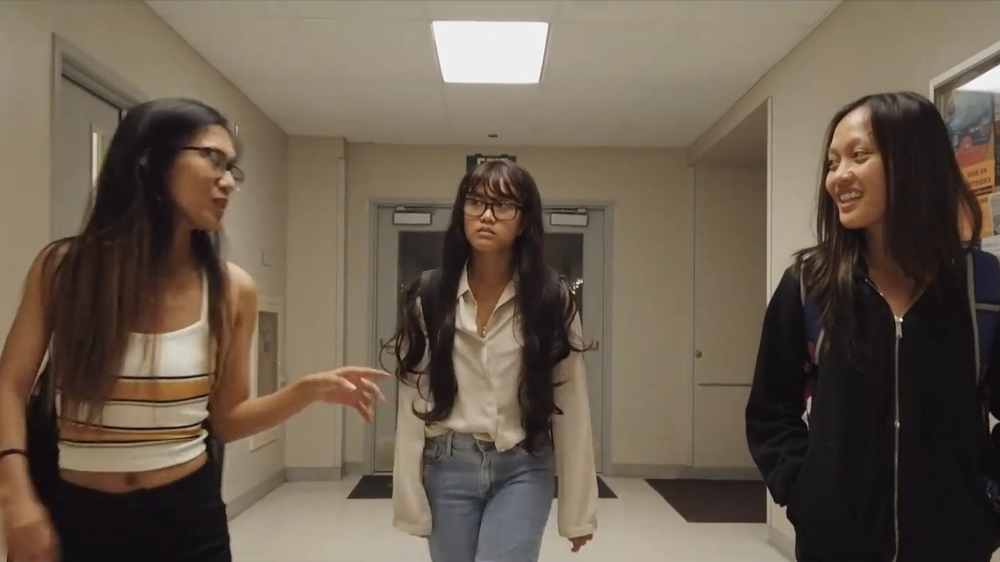

Floraminda is a drama film centered around around the journey to accepting to one's cultural identity. It is a project created by students of the Ilokano 401 and 486 classes at the University of Hawaiʻi at Mānoa’s Ilokano Language & Literature Program for the Fall 2019 Ilokano Drama Fest. The project is also under Awan Budget Productions, a nonprofit student-led venture aiming to promote awareness for the Ilocano language and culture.

Synopsis: A college student is assigned a class project that causes an uncomfortable confrontation with her past and present identities. With the introduction of a project that allows her to peer into her past, she becomes frightened by that idea; unknowingly but deep down there is this fear. This fear comes from the fact that she does not want her current ideals to be changed. But a part of her still holds onto her past, that is why she feels fear. 

For this project, I played the role of the main character, Mindy. I also pitched in the idea of the plot. As the main character of a film, you will be the main focus. Main characters are whose story is being told and whose voices are being heard. In all types of group projects, a presentation is always given to sell the final product. There is someone who gives speeches to convince others. The representative of the project does not always have to be someone who did all of the work, but it has to be someone who is convincing to its audience. For the representative to be convincing, the work and effort of those who did the work behind the scenes must also be convincing.

This project was filmed in Kalihi and UH Mānoa.

You can watch the trailer [here](https://www.facebook.com/awanbudgetproductions/videos/218703846160849/).
