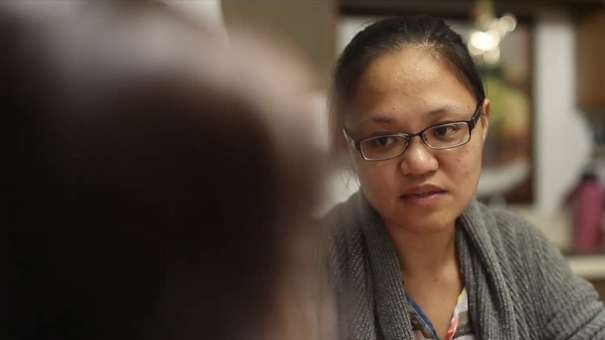

Floraminda is a drama film centered around around the journey to accepting to one's cultural identity. It is a project created by students of the Ilokano 401 and 486 classes at the University of Hawaiʻi at Mānoa’s Ilokano Language & Literature Program for the Fall 2019 Ilokano Drama Fest. The project is also under Awan Budget Productions, a nonprofit student-led venture aiming to promote awareness for the Ilocano language and culture.

For this project, I played the role of the main character, Mindy.

You can watch the trailer [here](https://www.facebook.com/awanbudgetproductions/videos/218703846160849/).
