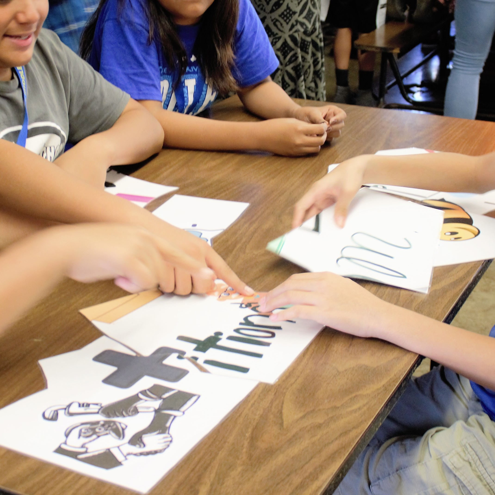
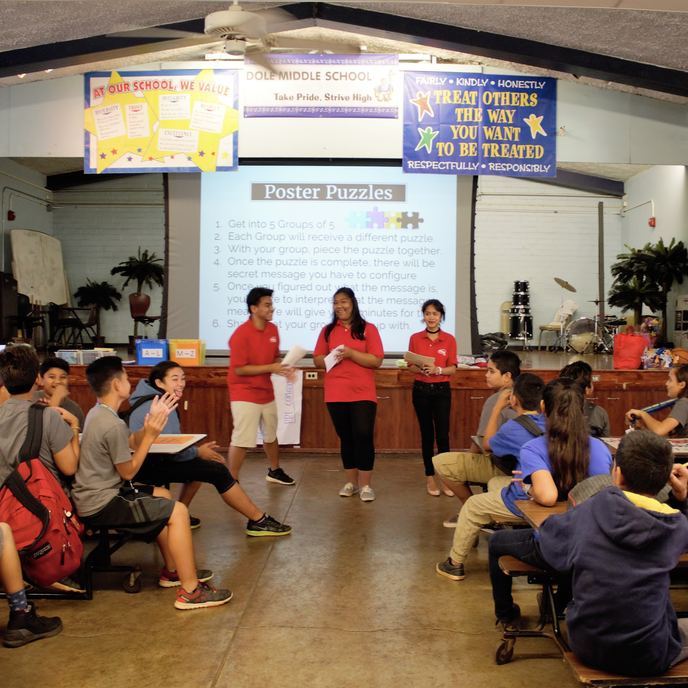

Project Salamat! Arigatou! Gracias! Mahalo! is a STAR Events Project under Leadership Service in Action category for Family, Career, and Community Leaders of America (FCCLA), a high school Career & Technical Student Organization focused on Family & Consumer Sciences.

Collaborators of this project have experienced straying away from their ethnic culture(s) due to pressure, especially if one has immigrated at a young age. This project sought to promote cultural appreciation and harmony, with an emphasis to first-generation immigrant students in their own neighborhood, Kalihi. It was conducted at Farrington High School, Kalakaua Middle School, and Dole Middle School in the 2016-2017 Academic Year. All collaborators were in their third year of high school when this project was conducted.

For this project, I was involved in preparation of the presentations in schools, as well as preparation of the presentations for conferences. I was involved in the brainstorming for project ideas, as I talked about my experiences as an immigrant and groupmates resonated with them. I did research and interviewed a Psychology professor. I prepared materials and props for the presentation. I presented in Dole Middle School and Kalakaua Middle School. In terms of preparation of the presentation for conferences, I was mainly responsible for drafting and revising scripts. My group mates and I were involved in every aspect of the project so that we were all on the same page in terms of the project but also because we were a small group. The main barrier of the project was conflicting schedules. We resolved that by prioritizing the project and meeting up during the weekend.

  
  
  
  

Project has received Gold Medal at both state- and national-level. It was presented at the CTSO (Career and Technical Student Organizations) Conference in Honolulu on February 2017 and at the FCCLA National Leadership Conference at Nashville in July 2017. Gold Medal is the highest award that a project in this category can receive.

