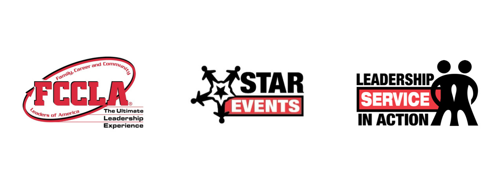
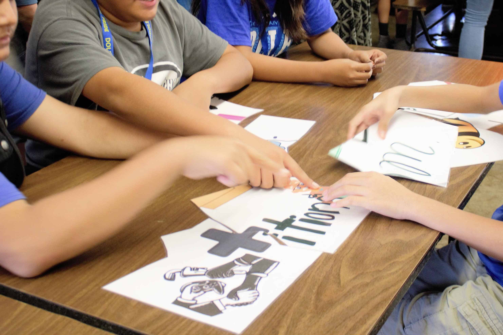
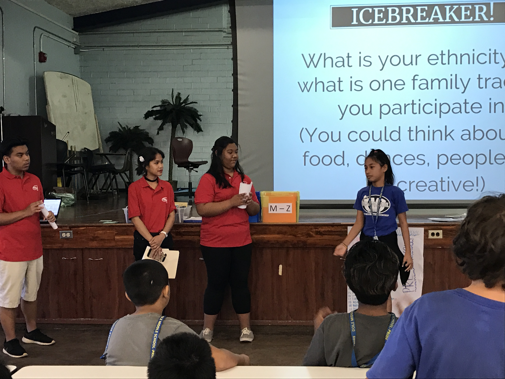
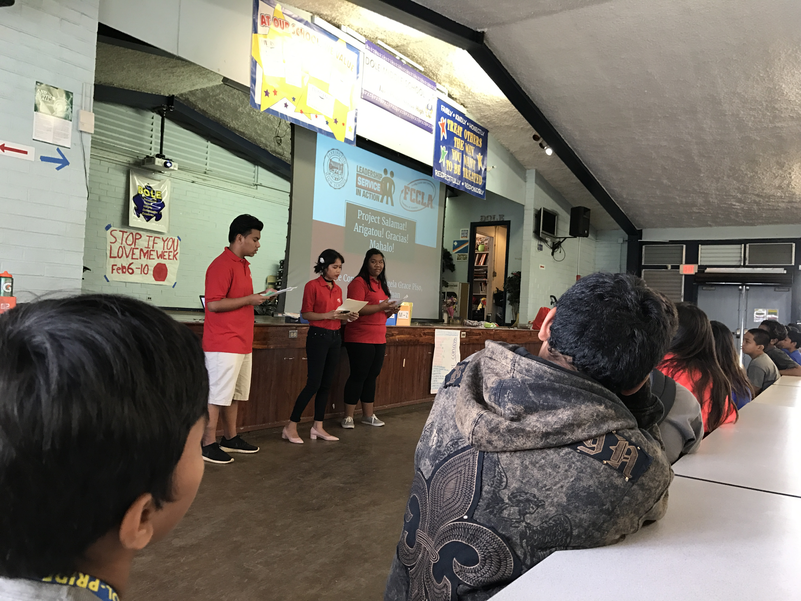
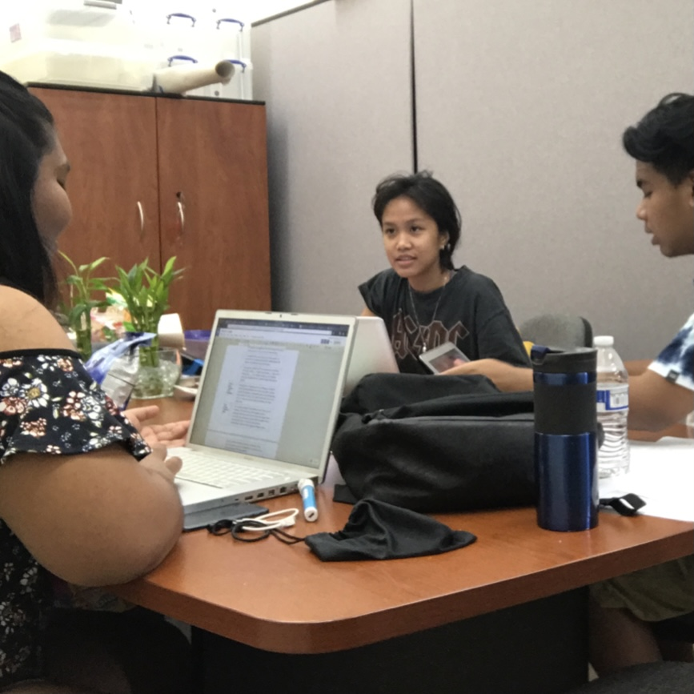

Project Salamat! Arigatou! Gracias! Mahalo! is a STAR Events Project under Leadership Service in Action category for Family, Career, and Community Leaders of America (FCCLA), a high school Career & Technical Student Organization focused on Family & Consumer Sciences.

Collaborators of this project have experienced straying away from their ethnic culture(s) due to pressure, especially if one has immigrated at a young age. This project sought to promote cultural appreciation and harmony, with an emphasis to first-generation immigrant students in their own neighborhood, Kalihi. It was conducted at Farrington High School, Kalakaua Middle School, and Dole Middle School in the 2016-2017 Academic Year. All collaborators were in their third year of high school when this project was conducted.

  
  
  
  

Project has received Gold Medal at both state- and national-level. It was presented at the CTSO (Career and Technical Student Organizations) Conference in Honolulu on February 2017 and at the FCCLA National Leadership Conference at Nashville in July 2017.

